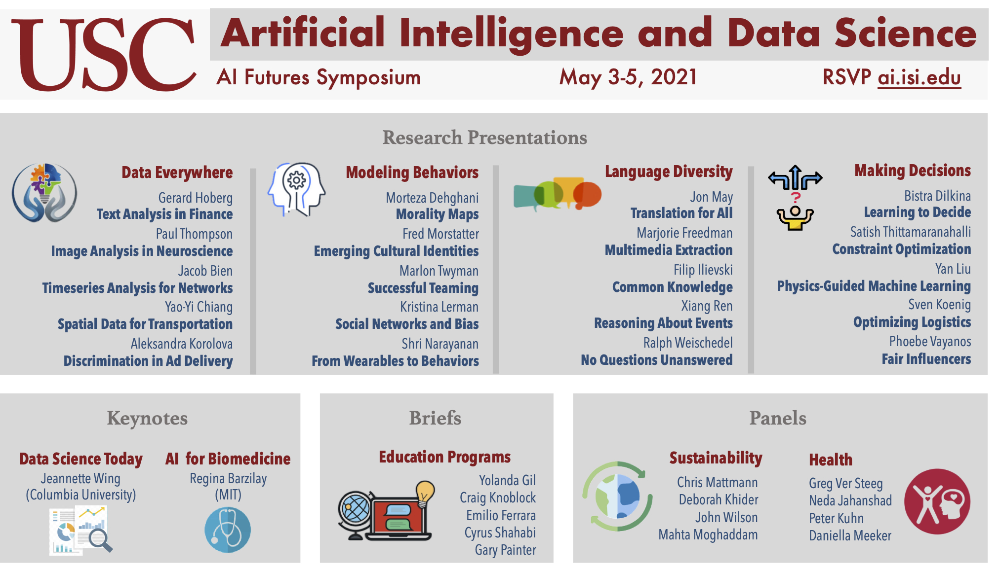

---

Profound innovations at the intersection of artificial intelligence and data science are changing our lives.  These innovations are transforming how we improve our health, connect with others, sustain our environment, understand complex systems, and enrich our lives.  This symposium will present an overview of interdisciplinary research at USC in these critical areas.

This event is part of the USC AI Futures Symposium Series. A prior event was held in January 2021 with the theme: [Will AIs Ever Be One of Us?](https://www.isi.edu/events/ai_symposium_2021).

## Agenda

A preliminary agenda is available [here](agenda).

## Attending

Please register [here](register).

## Questions?

Please email any questions to **ai.isi.usc.edu@gmail.com**.

## Subscribe

Subscribe to our [USC AI Futures mailing list](https://mailman.isi.edu/mailman/listinfo/usc-ai-futures-events) to receive information about this and future events.
